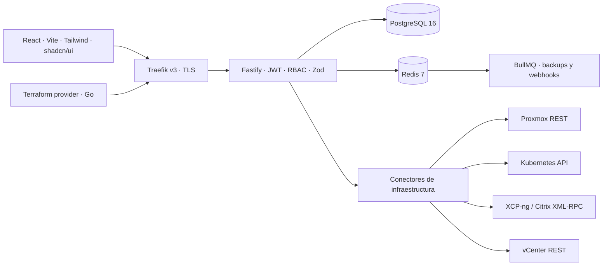

# m4m0 NEXUS

**Control unificado de infraestructura · m4m0 consulting · [m4m0.es](https://m4m0.es)**

Base de plataforma autohospedada con React, Fastify y TypeScript estricto. Incluye conectores reales, API con RBAC, administración web, PostgreSQL, Redis, Docker Compose, Helm y un provider de Terraform en Go.

**Versión 0.1.0, base funcional en desarrollo.** La compilación y las pruebas locales no equivalen a una certificación de producción ni a compatibilidad comprobada con un hipervisor real. Consulta [la matriz de capacidades](docs/CAPABILITIES.md) antes de habilitar operaciones sobre infraestructura. Las funciones no implementadas devuelven un error explícito; la demostración nunca ejecuta operaciones remotas.

## Desplegar con Docker Compose (sin instalar Node.js)

```bash
git clone https://github.com/amolinagrx/m4m0-nexus.git
cd m4m0-nexus
./scripts/deploy.sh local
```

Abre **http://localhost:8080**. El script genera `.env` con secretos aleatorios si no existe, construye las imágenes, arranca PostgreSQL, Redis, API y frontend, y crea el administrador inicial mediante un servicio `bootstrap` idempotente. Inicia sesión con `ADMIN_EMAIL` y `ADMIN_PASSWORD` de `.env`. El modo de demostración no es una cuenta de usuario.

Solo necesitas Docker y Compose v2, disponible tanto como `docker compose` como `docker-compose`. También puedes ejecutar los pasos directamente:

```bash
./scripts/deploy.sh init
docker-compose -f docker-compose.local.yml up -d --build
# Equivalente moderno:
# docker compose -f docker-compose.local.yml up -d --build
```

Para otro puerto: `NEXUS_HTTP_PORT=8081 ./scripts/deploy.sh local`. El acceso HTTP local está limitado a loopback. Para publicar con dominio y TLS, utiliza el despliegue de producción descrito abajo.

## Desarrollo con Node.js

Requisitos: Node.js 22+, npm, Docker con Compose. Go y Helm son opcionales; sus verificaciones se pueden ejecutar con imágenes de Docker.

```bash
npm ci
node scripts/setup-env.mjs --dev
# El script crea .env con secretos aleatorios y no sobrescribe uno existente.
docker compose -f docker-compose.dev.yml up -d --wait
npm run build
npm run seed -w backend
```

Abre dos terminales en la raíz del proyecto:

```bash
npm run dev -w backend
```

```bash
npm run dev -w frontend
```

Abre **[http://127.0.0.1:5173](http://127.0.0.1:5173)**. La primera vista es una demostración identificada. Pulsa **Conectar mi entorno** e inicia sesión con `ADMIN_EMAIL` y `ADMIN_PASSWORD` de tu archivo `.env`. Las credenciales de demostración no son cuentas reales. No hay contraseñas predeterminadas.

El bootstrap de administrador es idempotente: no cambia la contraseña de una cuenta ya existente. Al salir de la sesión, la interfaz vuelve al entorno de demostración.

## Docker en un servidor

En un checkout nuevo, con un dominio apuntando al servidor:

```bash
./scripts/deploy.sh init
# Edita NEXUS_HOST y ACME_EMAIL en .env.
./scripts/deploy.sh production
# Equivalente después de preparar .env:
# docker-compose up -d --build
```

Permite los puertos 80 y 443 para el desafío ACME de Traefik. El administrador se crea automáticamente cuando PostgreSQL está listo; los arranques posteriores no cambian una cuenta existente. La contraseña bootstrap se entrega únicamente al servicio temporal de inicialización.

Los archivos son **stacks independientes**, no overrides combinables:

| Archivo                    | Uso                                                              |
| -------------------------- | ---------------------------------------------------------------- |
| `docker-compose.yml`       | Producción completa con Traefik y HTTPS                          |
| `docker-compose.local.yml` | Aplicación completa en HTTP de loopback, sin DNS ni certificados |
| `docker-compose.dev.yml`   | Solo PostgreSQL y Redis; Vite y API corren en el host            |

Los stacks completos construyen sus URLs internas a partir de `APP_DB_PASSWORD` y `REDIS_PASSWORD`, por lo que pueden reutilizar los secretos de un `.env` de desarrollo. Conserva contraseñas generadas en hexadecimal; si usas caracteres especiales, adapta las URLs con percent-encoding.

El proxy usa configuración de archivos y no monta el socket de Docker. PostgreSQL y Redis no publican puertos en los stacks completos. Los volúmenes conservan los datos tras `down`; no uses `down -v` para actualizar.

[Guía completa de despliegue](docs/DEPLOYMENT.md).

## Arquitectura



- Monorepo con npm workspaces y lockfile compartido.
- Backend en `backend/src`; registro de rutas en `app.ts`, arranque de workers en `index.ts`.
- Capa de conectores tipada por `BaseConnector`; IDs externos aislados de los UUID internos.
- Inventario de VM persistido tras sincronización. Hosts, storage y redes se consultan al proveedor.
- Contraseñas locales con Argon2id. Credenciales de infraestructura, LDAP y destinos de backup cifradas con AES-256-GCM.
- Refresh tokens rotativos almacenados por hash; detección de reutilización por familia.
- API tokens con scopes, revocación y control de permisos usando el rol vigente de la cuenta.
- Socket.io para resumen de inventario; WebSockets con tickets de un solo uso para consolas y streams Kubernetes.
- Procesos de plugins con límite de memoria y tiempo. **Solo código revisado de confianza; no constituyen un sandbox para código malicioso.**

## Directorios

```text
backend/                 API, conectores, servicios, middleware y tests
frontend/                Aplicación React/Vite y componentes accesibles
  src/pages/             Kubernetes, backups y exportación/importación
  src/components/        Formularios, consola noVNC, terminal xterm y UI
  src/services/          Cliente API y datos de demostración
database/init-scripts/   Esquema, índices, auditoría y rol de aplicación
proxy/                   Traefik y rutas TLS
plugins/example-plugin/  Plugin revisable en TypeScript y JavaScript
terraform-provider/      Provider Go, pruebas y ejemplos
helm/m4m0-nexus/          Chart y valores de producción
scripts/                 Configuración segura y verificaciones locales
docs/                    Guías operativas y estado de capacidades
.github/workflows/       CI y construcción manual de artefactos
```

## Docker y backups con Zerobyte

En **Docker** puedes registrar hosts mediante HTTPS/mTLS, consultar contenedores y proyectos Compose, imágenes, volúmenes y redes; crear contenedores desde imágenes locales y operar su ciclo de vida. En **Backups Docker** puedes conectar Zerobyte v0.42.0, crear/editar programaciones, ejecutar copias, consultar historial y snapshots y abrir Zerobyte para restaurar.

Las conexiones se guardan cifradas. Compose aplica automáticamente la migración a las instalaciones existentes. Incluimos un stack independiente de Zerobyte con HTTPS en `examples/zerobyte` y una prueba real de backup de un volumen Docker.

[Configuración, despliegue y límites de Docker/Zerobyte](docs/DOCKER-ZEROBYTE.md).

## Conectar un hipervisor

En **Infraestructuras → Añadir infraestructura**, selecciona el proveedor, introduce su endpoint HTTPS y sus credenciales. Después pulsa **Sincronizar**.

### Proxmox VE

Usa un token dedicado con permisos limitados a los recursos gestionados. El ID tiene forma `nexus@pve!nexus`; el valor secreto va en el campo API token. También se admiten usuario/contraseña y tickets de sesión. Si usas una CA privada, pega su certificado PEM; no se deshabilita la verificación TLS.

El conector normaliza los IDs como `nodo/qemu/100` o `nodo/lxc/101`. Estos IDs solo aparecen en la capa del proveedor; las rutas `/vms/:id` usan el UUID de NEXUS. Los apagados son ordenados, las operaciones asíncronas esperan el resultado de la tarea UPID y los fallos del proveedor no se presentan como éxito.

La creación de VM clona una **plantilla QEMU existente**: `template_id=pve-node-01/qemu/9000`. Ajusta CPU, RAM y tamaño del primer disco SCSI/virtio/SATA. No soporta reducción de discos, LXC ni plantillas de un catálogo externo. La VM queda apagada. Si falla la configuración tras clonar, se intenta eliminar el clon; un fallo de limpieza identifica el recurso que necesita revisión.

### Kubernetes

Endpoint del API server, bearer token de un ServiceAccount o certificados de cliente inline. También se admite kubeconfig con token/certificados inline y CA incorporada. Se rechazan `exec`, `auth-provider`, rutas de archivos locales y TLS sin validación en kubeconfig; el server del contexto debe coincidir con el endpoint registrado.

La cuenta necesita permisos de Kubernetes para los recursos concretos. El RBAC de NEXUS se aplica adicionalmente. Para métricas hace falta metrics-server; Kubernetes no proporciona las métricas de red a través de metrics.k8s.io.

En la UI puedes seleccionar cluster, namespace, pods, deployments, services, ingress, PVCs, configmaps y metadatos de secrets. Los logs se consultan o siguen en tiempo real; la terminal abre `/bin/sh` en el primer contenedor de la lista. Para otros contenedores/comandos usa la API de tickets. El port-forward es un túnel binario de WebSocket a un puerto del pod, sin abrir listeners TCP en el servidor de NEXUS.

### XCP-ng y Citrix Hypervisor

Endpoint HTTPS de XAPI y cuenta de servicio. Se usa `session.login_with_password`, operaciones `VM.*` y `get_all_records`. Inventario, encendido, apagado ordenado, reinicio, snapshot, migración y borrado están implementados. RRD y túnel de consola XAPI están pendientes.

### VMware vSphere

El conector usa REST moderno de **vCenter** (`/api/session`, `/api/vcenter/*`). Inventario, encendido, apagado/reinicio del invitado y borrado están implementados. Apagado/reinicio requieren herramientas del invitado. No se ofrece aún conexión SOAP directa a ESXi, snapshots/migración SOAP ni WebMKS. No selecciones este conector para un ESXi autónomo esperando compatibilidad completa.

## LDAP / Active Directory

En **LDAP / Active Directory**, configura URL LDAPS, bind DN, contraseña de servicio, base y filtro de búsqueda. Para AD, `sAMAccountName` suele ser el atributo de usuario; para OpenLDAP, `uid`. El atributo de email debe proporcionar una dirección válida.

Ejemplo de mapeo de grupos:

```json
{
  "CN=NexusAdmins,OU=Groups,DC=example,DC=com": "admin",
  "CN=NexusOperators,OU=Groups,DC=example,DC=com": "user"
}
```

Los usuarios sin grupo mapeado reciben `readonly`. Se escapan los valores de búsqueda, se rechazan contraseñas vacías y colisiones con cuentas locales. El formulario prueba la conexión antes de guardar. `/ldap/sync` ejecuta sincronización manual; el backend consulta el intervalo configurado para la sincronización periódica.

El acceso local permanece disponible explícitamente cuando el directorio no responde. No se transforma un rechazo de LDAP en un inicio de sesión local automático. Mantén una cuenta administrativa local de recuperación. La sincronización no elimina ni desactiva automáticamente usuarios ausentes del directorio.

## Webhooks

1. Autoriza el origen HTTPS exacto en `WEBHOOK_ALLOWED_ORIGINS`.
2. Crea el webhook con sus eventos, método, cabeceras opcionales y secreto HMAC.
3. Ejecuta el test desde UI y consulta los logs de entrega.

```json
{
  "name": "Operaciones",
  "url": "https://hooks.example.com/nexus",
  "events": ["vm.started", "vm.stopped", "backup.failed"],
  "method": "POST",
  "secret": "un-secreto-largo-del-destinatario",
  "retryCount": 3,
  "timeout": 30
}
```

BullMQ entrega de forma asíncrona con un máximo de tres intentos y backoff exponencial de 1 y 2 segundos. `X-Nexus-Delivery` es estable entre reintentos. La firma es `sha256=` + HMAC-SHA256 del **cuerpo JSON exacto** usando el secreto. `X-Nexus-Timestamp` coincide con el timestamp del payload. Para GET, el cuerpo firmado es el JSON almacenado en el parámetro `payload`.

El consumidor debe verificar la firma, limitar la antigüedad del timestamp y deduplicar `X-Nexus-Delivery`. La entrega es al menos una vez; no se sigue ninguna redirección. El formato genérico de NEXUS no coincide con el formato de mensaje de Slack: utiliza un adaptador receptor para transformarlo.

[Referencia de API y ejemplos](docs/API.md).

## API tokens

Crea un token desde **API tokens**, copia el valor de una sola visualización y guárdalo en tu gestor de secretos. La base de datos conserva SHA-256 del token, no el secreto.

```bash
curl --fail --header "Authorization: Bearer $NEXUS_API_TOKEN"   https://nexus.example.com/api/v1/vms
```

Ejemplos de scopes: `vms:read`, `vms:write`, `infra:read`, `infra:write`, `kubernetes:read`, `kubernetes:write`, `webhooks:write`, `tokens:write`.

Los scopes se intersectan con el rol actual. Un token `vms:write` de una cuenta `readonly` no puede escribir. Un token puede crear otro solo si tiene `tokens:write`, sin ampliar scopes ni extender su propia caducidad. Las rotaciones desde UI requieren sesión interactiva. La revocación afecta a la siguiente petición; las sesiones de consola en curso revalidan acceso cada 10 segundos.

## Backups y restauración

- **Configuración**: tipos `full` e `infrastructure`, exportación JSON, compresión gzip y cifrado opcional AES-256-GCM con clave derivada por scrypt. `full` incluye cuentas; no incluye API tokens ni auditoría automáticamente.
- **VM Proxmox**: `vzdump`, modo snapshot y zstd, almacenado en el storage ID del propio Proxmox. No se confunde un snapshot de inventario con una copia de disco.
- **Destino de configuración**: volumen local, S3 compatible o un volumen NFS/SMB montado por el operador en `/data/backups`.
- **Programación**: cron UTC en BullMQ, ejecución manual e historial. Retención por días para archivos de configuración.
- **Restauración JSON**: validación de integridad, esquemas por tabla y transacción PostgreSQL. Añade registros ausentes; no sobrescribe los existentes ni modifica auditoría local. SQL se exporta para restauración supervisada con PostgreSQL, no se ejecuta SQL arbitrario desde la API.

Conserva **ENCRYPTION_KEY** junto con la copia, en un almacén separado. Las credenciales internas mantienen el cifrado con esa clave; la contraseña del archivo no sustituye la clave del servidor. Las exportaciones contienen material sensible incluso cuando las contraseñas están hasheadas o cifradas.

[Guía de copias y recuperación](docs/BACKUPS.md).

## Kubernetes / Helm

PostgreSQL y Redis son dependencias externas del chart. Inicializa su esquema y crea un Secret con `DATABASE_URL`, `REDIS_URL`, `JWT_SECRET` y `ENCRYPTION_KEY` usando tu gestor de secretos. No guardes sus valores en `values.yaml`.

```bash
helm lint helm/m4m0-nexus
helm upgrade --install nexus helm/m4m0-nexus   --namespace nexus --create-namespace   -f helm/m4m0-nexus/values.production.yaml   --set existingSecret=nexus-secrets   --set ingress.host=nexus.example.com   --set corsOrigin=https://nexus.example.com
```

Construye y publica las imágenes en **tu** registry antes de desplegar y sustituye los nombres `registry.example.com`. Configura el certificado del Ingress mediante cert-manager o tu mecanismo habitual. No se ha publicado ninguna imagen ni desplegado en un cluster externo.

## Terraform

Se incluyen cinco recursos: infraestructura, VM, webhook, usuario y API token. La creación de VM actualmente usa plantillas QEMU de Proxmox. Cambiar su dimensionamiento o plantilla requiere reemplazo según el esquema del provider; revisa siempre `terraform plan`.

```bash
cd terraform-provider
go test ./...
go build -o terraform-provider-m4m0nexus
```

[Instalación local y ejemplos](terraform-provider/README.md). **El provider no está publicado en Terraform Registry.** Publicarlo requiere un repositorio, releases firmadas y la titularidad del namespace de m4m0; los archivos de CI solo construyen artefactos.

## Plugins

Copia un módulo revisado a `plugins/<id>`, con `manifest.json`, `package.json` e `index.js`. En UI instala el ID y actívalo. No se aceptan URLs arbitrarias, paquetes remotos ni rutas fuera del directorio aprobado.

El ejemplo `example-plugin` puede bloquear el arranque de VM incluidas en `blockedVMs`. Los hooks se cargan mediante `import()` en un proceso hijo. Se registran ejecuciones en auditoría y se pueden consultar por plugin. Desactivar o desinstalar elimina la ejecución/registro en NEXUS, no borra el código del volumen.

[Guía de desarrollo de plugins](plugins/README.md).

## Verificación

```bash
npm run build
npm test
npm run test:integration
npm run format:check
npm audit --audit-level=high
```

La suite de integración necesita el stack de desarrollo y usa una base separada `nexus_test`. Comprueba autenticación, reutilización de refresh, RBAC, revocación, cifrado, mantenimiento, importación transaccional y auditoría inmutable para la cuenta de aplicación. No ejecuta comandos sobre hipervisores reales.

```bash
docker compose build backend frontend
node scripts/smoke-containers.mjs
# Si no tienes Go o Helm instalados:
docker run --rm -v "$PWD/terraform-provider:/src" -w /src golang:1.24-bookworm go test ./...
docker run --rm -v "$PWD/helm:/charts:ro" alpine/helm:3.18.6 lint /charts/m4m0-nexus
```

Consulta [el informe de validación](docs/VALIDATION.md) y [los límites operativos](docs/SECURITY.md). Las validaciones locales no utilizan servidores de tu organización. El despliegue HTTPS requiere un dominio y un servidor configurados por el operador.
